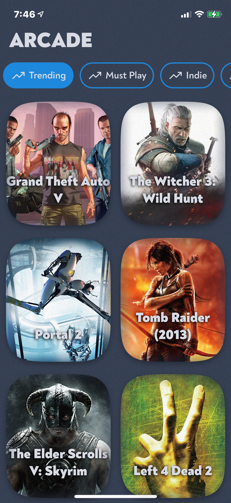
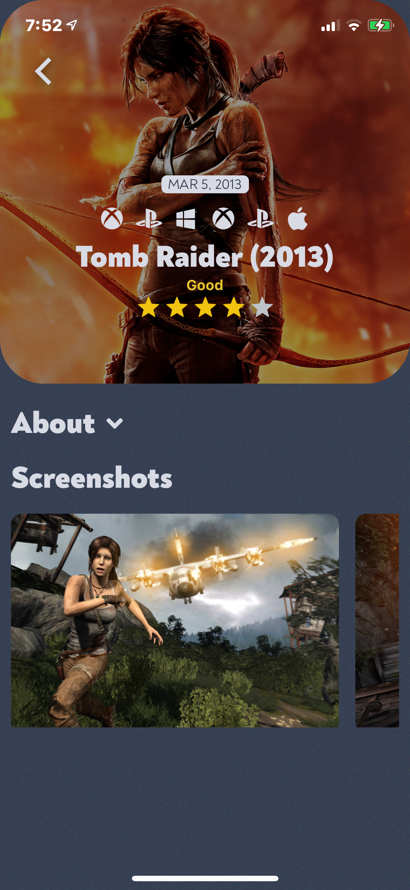
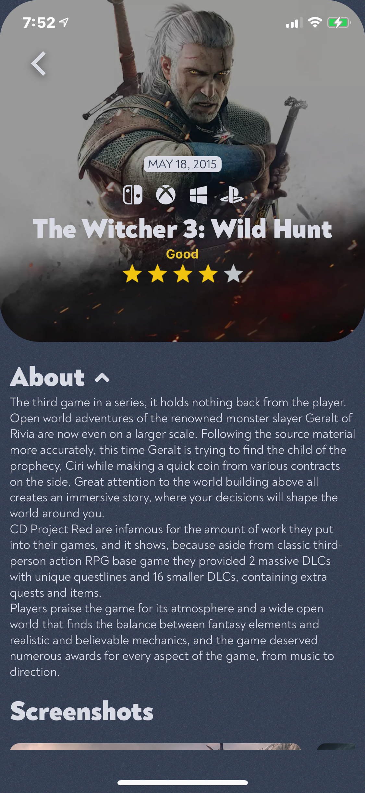

<h1 align="center">🎮 SIDEQUEST</h1>

<p align="center">A video game discovery app built with React Native and Expo, powered by the RAWG database.<br/><em>Responsive from phone to desktop.</em></p>

<p align="center">
  
  
  
</p>

<p align="center">
  
  
  
</p>

> **Where this project is heading:** ARCADE (2021) is being resurrected and
> evolved into **Respec** — an app for time-poor gamers that answers _"what can
> I actually finish?"_ The full product spec lives in
> [`docs/PRODUCT.md`](./docs/PRODUCT.md), and validation work in
> [`docs/validation/`](./docs/validation/). This README covers the current
> codebase: a modernised version of the original game-discovery app.

## Stack

- [Expo SDK 57](https://docs.expo.dev/) / React Native 0.86 / React 19
- TypeScript (strict) · [expo-router](https://docs.expo.dev/router/introduction/) file-based navigation
- ESLint + Prettier · CI via GitHub Actions
- [RAWG API](https://rawg.io/apidocs) for game data

## Get started

```sh
git clone https://github.com/ginoleeswan/sidequest
cd sidequest
npm install

# API key (free): https://rawg.io/apidocs
cp .env.example .env   # then paste your key in

npx expo start
```

Open in [Expo Go](https://expo.dev/go), an emulator, or press `w` for web.

### Scripts

| Command                              |                                                 |
| ------------------------------------ | ----------------------------------------------- |
| `npm run typecheck`                  | TypeScript, no emit                             |
| `npm run lint`                       | ESLint                                          |
| `npm run format`                     | Prettier write                                  |
| `node scripts/duration-coverage.mjs` | data-source validation (see `docs/validation/`) |

## Deploy (Vercel)

The web build is a static export — `vercel.json` is already configured.

1. Import the repo at [vercel.com/new](https://vercel.com/new) (framework
   preset: **Other** — `vercel.json` supplies the build command and output
   directory).
2. Add one environment variable in the project settings:
   `EXPO_PUBLIC_RAWG_API_KEY` = your RAWG key.
3. Deploy. Dynamic game pages (`/game/123`) are served via the rewrite in
   `vercel.json`.

Or from the CLI: `npx vercel --prod` (after `npx vercel env add EXPO_PUBLIC_RAWG_API_KEY`).

## Structure

```
src/
  app/          # expo-router routes (_layout, index, game/[id])
  api/          # typed RAWG client
  components/   # UI components
  styles/       # colors, typography
assets/         # fonts, icons, images
docs/           # product spec, validation, screenshots
```

## Author

**Gino Swanepoel** —
[GitHub](https://github.com/ginoleeswan) ·
[Twitter](https://twitter.com/mrginolee) ·
[LinkedIn](https://linkedin.com/in/ginoswanepoel)
